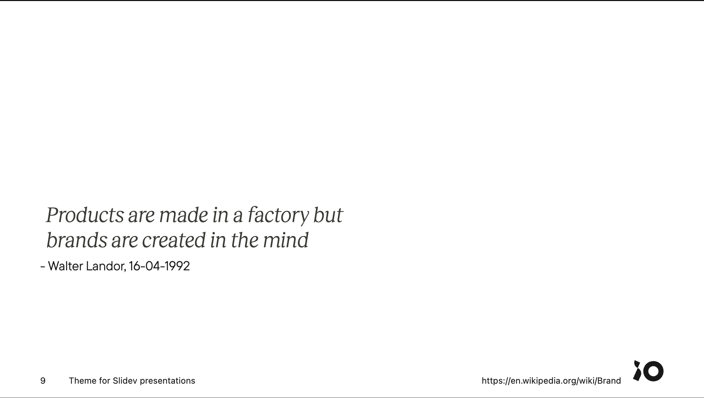

# slidev-theme-iodigital

[](https://www.npmjs.com/package/slidev-theme-iodigital)

An iO Digital theme for [Slidev](https://github.com/slidevjs/slidev).

## Install

Add the following frontmatter to your `slides.md`. Start Slidev then it will prompt you to install the theme automatically.

```
---
theme: iodigital
---
```

Learn more about [how to use a theme](https://sli.dev/themes/use).

## Settings
Next to the [available frontmatter customizations](https://sli.dev/custom/), this theme provide a few additional ones.

| Name   | Type      | Default | Use         | Description |
| ------ | --------- | ------- | ----------- | ----------- |
| footer | `boolean` | `true`  | First Slide | Display the footer on each slide (except for layouts `cover`, `intro` & `end`)

## Layouts

This theme provides the following layouts:

### Default
This layout will probably be most used for content slides. You can put anything in for content. Whether it be text, an image, a list, an iframe. Just make sure it fits the slide.


Usage:

```
---
layout: default <!-- optional -->
---
```

# Slide title first
## Optional subtitle

Amazing content which can be anything, as long as it fits the slide. Just be aware that the subtitle will be show above the title. Both are on the left side.

### Cover
As the name suggests, this layout is the first slide of your slide deck. It announces the title/subject of the presentation.


Usage:

```
---
layout: cover
image: /path/to/cover/image.jpg # Can be absolute or relative
---
```

### Intro
Use a single slide per speaker to help introduce them.


Usage:
```
---
layout: intro
image: /path/to/speaker/image.png
imageSide: left|right
---

# Speaker name

Speaker Description

::social::
<SocialLink network="io" handle="speaker-handle" />
<SocialLink network="linkedin" handle="SpeakerHandle" />

```

### Quote 
Use a single slide per quote or statement 


 
Usage:
```
---
layout: quote
author: Walter Landor
source: 16-04-1992
cite: https://en.wikipedia.org/wiki/Brand
---

Products are made in a factory but brands are created in the mind
```

## Components

This theme provides the following components:

### SocialLink
Mainly used in (but not limited to) the [layout](#intro) layout. It creates an anchor to a known social network. Only provide the name of the `network` and the speaker's `handle`. Currently, the following [networks](/theme.config.ts#L20) are supported:
- iO Techhub
- LinkedIn
- Twitter
- Github

Usage:

```
<SocialLink handle="some-handle" network="io" />
```

### ProfileCard
The this component can be used to create a profile card displaying the `firstName` and `lastName` and optionally the `functionTitle`, `email`, `telephone` and profile picture (`image`). 

Usage:

```
<ProfileCard 
  firstName="John" 
  lastName="Doe" 
  functionTitle="Front-end developer"
  email="john.doe@iodigital.com"
  telephone="06-12345678"
  image="https://picsum.photos/200/200"
  />
```

### Icons

This theme supports Material Design Icons (MDI) out of the box. Custom icons are also available (e.g. io logo). Each icon has its own (self-closing) element and can be written in both CamelCase and kebab-case.

Usage:

```
<IconMdiAccount />
<icon-mdi-account />
<icon-mdi-account></icon-mdi-account>
<IconIoLogo />
<IconIoLogo></IconIoLogo>
```

## Contributing

- `npm install`
- `npm run dev` to start theme preview of `example.md`
- Edit the `example.md` and style to see the changes
- `npm run export` to generate the preview PDF
- `npm run screenshot` to generate the preview PNG
