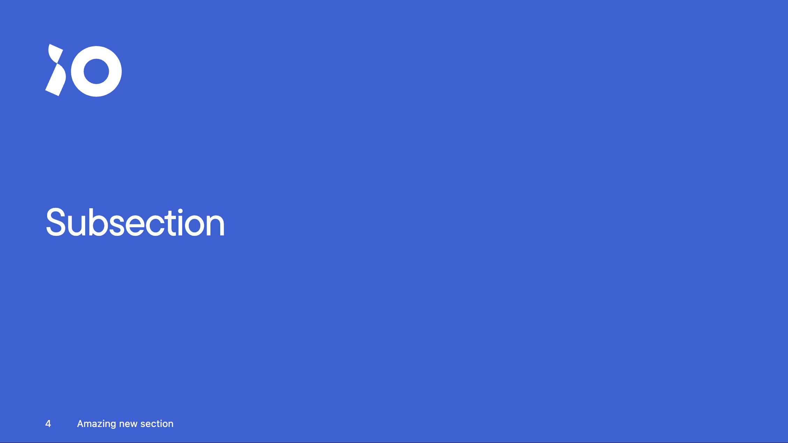
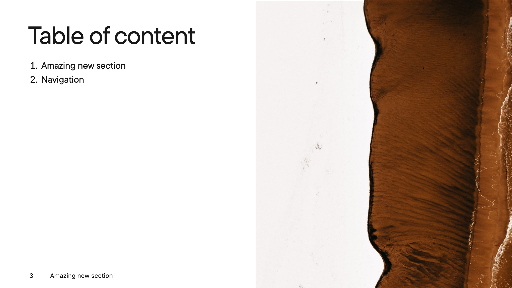

# slidev-theme-iodigital

[](https://www.npmjs.com/package/slidev-theme-iodigital)

An iO Digital theme for [Slidev](https://github.com/slidevjs/slidev).

## Install

Add the following frontmatter to your `slides.md`. Start Slidev then it will prompt you to install the theme automatically.

```
---
theme: iodigital
---
```

Learn more about [how to use a theme](https://sli.dev/themes/use).

## Settings
Next to the [available frontmatter customizations](https://sli.dev/custom/), this theme provides a few additional ones.

| Name   | Type      | Default | Use         | Description |
| ------ | --------- | ------- | ----------- | ----------- |
| footer | `boolean` | `true`  | First Slide | Display the footer on each slide (except for layouts `cover`, `intro` & `end`) |

### Transitions

The default transition behavior is handled based on the sections. Overriding the default is possible by adding the transition property to the frontmatter.

```
---
transition: slide-up
---
```

## Layouts

This theme provides the following layouts:

### Default
This layout will probably be most used for content slides. You can put anything in for content. Whether it be text, an image, a list, an iframe. Just make sure it fits the slide.


#### Usage

```
---
layout: default # optional
---

# Slide title first
## Optional subtitle

Amazing content which can be anything, as long as it fits the slide. Just be aware that the subtitle will be show above the title. Both are on the left side.
```

### Cover
As the name suggests, this layout is the first slide of your slide deck. It announces the title/subject of the presentation.


#### Usage

```
---
layout: cover
image: /path/to/cover/image.jpg # Can be absolute or relative
---
```

### Full
A full size layout. Title on top. Content can be anything you want. If you want to separate your content into columns, have floating images or a large video player, you can do so in your markdown. Just use HTML to create your own layout.


#### Usage

```
---
layout: full
---

# My Amazing title

Some content
```

### Iframe / Iframe-left / Iframe-right
This is the default sli.dev way to display an Iframe inside a slide. Make sure that you use the embed URL if it is provided.


#### Usage

```
---
layout: iframe / iframe-left / iframe-right
url: https://www.youtube.com/embed/dQw4w9WgXcQ
---
```

### Image
A large image as background with only a title. The title is either displayed as an overlay on the image or in a black box.

<div style="display:flex;gap:1em">
  
  
</div>

#### Usage

```
---
layout: image
image: path/to/my/image.jpg
variant: default|box
---

# Image layout in the [variant] variant
```

### Intro
Use a single slide per speaker to help introduce them.


#### Usage

```
---
layout: intro
image: /path/to/speaker/image.png
imageSide: left|right
---

# Speaker name

Speaker Description

::social::
<SocialLink network="io" handle="speaker-handle" />
<SocialLink network="linkedin" handle="SpeakerHandle" />
```

### Quote

Use a single slide per quote or statement


#### Usage

```
---
layout: quote
author: Walter Landor
source: 16-04-1992
cite: https://en.wikipedia.org/wiki/Brand
---

Products are made in a factory but brands are created in the mind
```

### Section

With only a title - and optional subtitle - this layout indicates a new subject within your slide deck.

Read more about [chapters and sections](./docs/CHAPTERS_AND_SECTIONS.MD).

<div style="display:flex;flex:33% 0 auto;gap:1rem">
  
  
  

  
  
  
  

  
  
</div>

#### Usage

```
---
layout: section
level: 1|2|3
---

# My New Section
## Optional subtitle

```

### Two-cols

As the name suggest, this layout divides the page in two columns (left / right). By default the content is placed in the left column and with the `::right::` slot you're able to place content in the right column.


#### Usage

```
---
layout: two-cols
division: 70/30
---

# Left side title

Lorem ipsum dolor sit amet, consectetur adipiscing elit. Nulla nec nunc orci. Donec sit amet tincidunt ipsum. Maecenas tristique ornare nisi a ullamcorper.

::right::

# Right side title

Lorem ipsum dolor sit amet, consectetur adipiscing elit.
- First item
- Second item
- Third item

```

## Components

This theme provides the following components:

### SocialLink
Mainly used in (but not limited to) the [layout](#intro) layout. It creates an anchor to a known social network. Only provide the name of the `network` and the speaker's `handle`. Currently, the following [networks](/theme.config.ts#L20) are supported:
- iO Techhub
- LinkedIn
- Twitter
- Github

#### Usage

```
<SocialLink handle="some-handle" network="io" />
```

### ProfileCard

This component can be used to create a profile card displaying the `firstName` and `lastName` and optionally the `functionTitle`, `email`, `telephone` and profile picture (`image`).

#### Usage

```
<ProfileCard
  firstName="John"
  lastName="Doe"
  functionTitle="Front-end developer"
  email="john.doe@iodigital.com"
  telephone="06-12345678"
  image="https://picsum.photos/200/200"
  />
```

### Icons

This theme supports Material Design Icons (MDI) out of the box. Custom icons are also available (e.g. io logo). Each icon has its own (self-closing) element and can be written in both CamelCase and kebab-case.

#### Usage

```
<IconMdiAccount />
<icon-mdi-account />
<icon-mdi-account></icon-mdi-account>
<IconIoLogo />
<IconIoLogo></IconIoLogo>
```

### Table of content

This component can be used to create a table of content based on the headings from every level 1 section slide.



#### Usage

```
---
layout: image-right (this can be any layout)
image: 'https://source.unsplash.com/collection/94734566/1920x1080'
---
# Table of content
<Toc />
```

## Contributing

For more information about contributing to this project see the [CONTRIBUTING.md](./CONTRIBUTING.md).

- `npm install`
- `npm run dev` to start theme preview of `example.md`
- Edit the `example.md` and style to see the changes
- `npm run export` to generate the preview PDF
- `npm run screenshot` to generate the preview PNG
